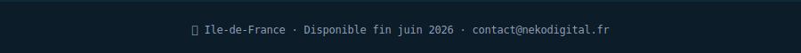

<div align="center">


</div>

<div align="center">


<br/>

[](https://nekodigital.fr)
[](https://www.linkedin.com/in/karim-a-a23816176)
[](mailto:contact@nekodigital.fr)
[](https://www.linkedin.com/in/karim-a-a23816176)

</div>

<br/>

```bash
$ whoami
```

> Technicien Systèmes & Réseaux — **TSSR Niveau 5** (Nextformation, déc. 2025 → juin 2026).  
> Dev fullstack reconverti infra : je comprends l'infra **et** le code qui tourne dessus.  
> Recherche **support N1/N2** ou **sysadmin junior polyvalent** — Île-de-France, dispo fin juin 2026.

<br/>

```bash
$ ls -la ./skills
```

<table>
<tr>
<td width="50%" valign="top">

**`🖥️  SYSTÈMES & RÉSEAU`**

| Compétence | Niveau |
|---|---|
| Windows Server 2025 | 🟩🟩🟩🟩🟩🟩🟩🟩⬛⬛ |
| Active Directory / GPO | 🟩🟩🟩🟩🟩🟩🟩⬛⬛⬛ |
| Debian 12 / Linux | 🟩🟩🟩🟩🟩🟩🟩🟩⬛⬛ |
| PowerShell / Bash | 🟩🟩🟩🟩🟩🟩⬛⬛⬛⬛ |
| GLPI 10 / LDAP | 🟩🟩🟩🟩🟩🟩🟩⬛⬛⬛ |
| DNS / DHCP / TCP-IP | 🟩🟩🟩🟩🟩🟩⬛⬛⬛⬛ |

</td>
<td width="50%" valign="top">

**`⚙️  VIRTUALISATION & BACKUP`**

| Compétence | Niveau |
|---|---|
| VMware Workstation | 🟩🟩🟩🟩🟩🟩🟩⬛⬛⬛ |
| vCenter 8 + ESXi 8 | 🟩🟩🟩🟩🟩🟩🟩⬛⬛⬛ |
| Veeam B&R | 🟩🟩🟩🟩🟩🟩⬛⬛⬛⬛ |
| iSCSI / vMotion | 🟩🟩🟩🟩🟩🟩🟩⬛⬛⬛ |
| Synology NAS | 🟩🟩🟩🟩🟩🟩🟩⬛⬛⬛ |
| Proxmox | 🟩🟩🟩🟩🟩🟩⬛⬛⬛⬛ |

</td>
</tr>
<tr>
<td width="50%" valign="top">

**`💡  DEV — atout différenciant`**

| Compétence | Niveau |
|---|---|
| TypeScript / Node.js | 🟦🟦🟦🟦🟦🟦🟦⬛⬛⬛ |
| Next.js 15 / React | 🟦🟦🟦🟦🟦🟦🟦⬛⬛⬛ |
| Symfony 7 | 🟦🟦🟦🟦🟦🟦🟦⬛⬛⬛ |
| Docker | 🟦🟦🟦🟦🟦🟦🟦🟦🟦⬛ |
| Prisma / Supabase | 🟦🟦🟦🟦🟦🟦🟦⬛⬛⬛ |

</td>
<td width="50%" valign="top">

**`🎓  FORMATIONS & CERTS`**

| | | |
|---|---|---|
| TSSR Niv.5 | Nextformation | 2025–26 |
| CDA Niv.6 | O'clock | 2023 |
| Bachelor | Chef de Projet Digital | 2019 |
| OPQUAST | | 2018 |
| Bac+2 | Maquettiste Infographiste | 2017 |

</td>
</tr>
</table>

<br/>

```bash
$ cat ./experience
```

**💼 CollectivHub — Freelance Fullstack Developer**

> Plateforme e-commerce pour AMAPs — circuits courts, agriculteurs locaux

```
stack  : Symfony 7 · React · TypeScript · Docker
infra  : API REST · déploiement VPS · PostgreSQL
rôle   : architecture, développement, déploiement complet
```

---

**🥋 KihApp — Développeur & Porteur de projet**

> SaaS gestion clubs de sport de combat — phase test avec association sportive réelle → modèle SaaS

```
stack  : Next.js 15 · TypeScript · Prisma · Supabase · Clerk · Stripe
infra  : VPS Hostinger · khiapp.eu · Cloudflare DNS
statut : phase test → déploiement SaaS en cours
```

<br/>

```bash
$ tree ./lab --charset=ascii
```

```
InfoTech Solutions SAS  [infotech.lan]
|
+-- Active Directory
|   +-- Windows Server 2025  (DC, AD DS, DNS, DHCP)
|   +-- GPO : fond ecran · restriction CMD · deploiement MSI Foxit
|   \-- GLPI 10 + integration LDAP/AD  (tickets N1/N2)
|
+-- Cluster VMware
|   +-- vCenter 8.0 + 2x ESXi 8.0 Update 3
|   +-- Datastore iSCSI  (VMnet11 · 172.20.20.0/24)
|   \-- Migration vMotion  (VMnet12 · 172.20.30.0/24)
|
+-- Backup
|   +-- Veeam B&R  (jobs full + incremental)
|   +-- Restore teste  (Veeam Backup Browser)
|   \-- Synology DS218+  (192.168.1.160)
|
\-- Reseau
    +-- DNS / DHCP / SSH
    \-- Cisco Packet Tracer
```

<br/>

```bash
$ cat ./stats
```

<div align="center">

[](https://github.com/kadev-oclock)

<br/>


</div>

<br/>

<div align="center">



</div>
